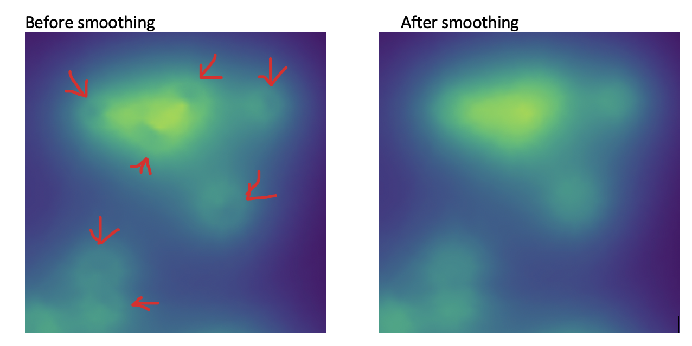

# microstructure-processing
Processing pipeline for filling missing values smoothly in 2D spatial fields.

# Core Functionality

nan_filling_inpainting.py provides a robust pre-processing pipeline for filling missing values (NaNs) in 2D spatial fields. Missing regions are first reconstructed using an iterative local neighbor-averaging scheme, where each NaN is replaced by the mean of its available 8-connected neighbors. This process propagates known information into unknown regions while preserving local continuity. The resulting fields can be used in deep learning model as inputs.

To further improve smoothness and eliminate residual artifacts, an optional biharmonic inpainting step is applied only at originally missing locations, ensuring that valid input data remain unchanged. The implementation supports single fields as well as batched inputs with flexible shapes, making it suitable for large-scale numerical or image-based datasets.

# Results Demo
One example of input structure, filled structure, and smoothed structure:

A zoomed-in view reveals why biharmonic inpainting is necessary for smoothing the filled regions.

